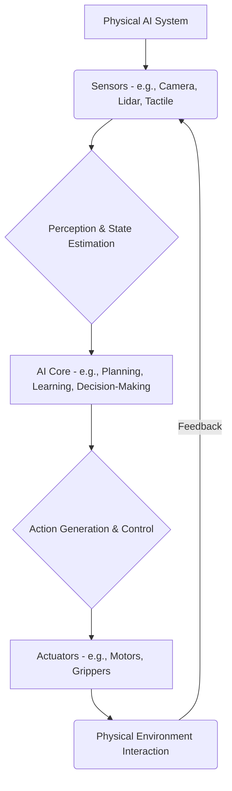

## 1.1 What is Physical AI?

Physical AI refers to artificial intelligence systems that interact with the real world through physical bodies, sensors, and actuators. Unlike purely software-based AI, Physical AI embodies intelligence, allowing it to perceive, reason, and act within a physical environment. This field combines aspects of artificial intelligence, robotics, control theory, and cognitive science.

**Diagram: Physical AI System Overview**



## 1.2 The Rise of Humanoid Robotics

Humanoid robotics focuses on building robots that resemble the human body in shape and capabilities. These robots are designed to operate in human-centric environments, performing tasks that require human-like dexterity, locomotion, and interaction. Advances in materials, computation, and AI have significantly propelled the development of humanoids, moving them from research labs to potential real-world applications.

**Key Characteristics of Humanoid Robots:**
*   **Bipedal Locomotion:** Ability to walk on two legs.
*   **Articulated Limbs:** Arms and hands with multiple degrees of freedom for manipulation.
*   **Sensor Suites:** Vision (cameras), proprioception (joint encoders), tactile sensing.
*   **Human-Robot Interaction (HRI):** Designed for safe and intuitive interaction with humans.

## 1.3 Why Study Physical AI and Humanoid Robotics?

The convergence of AI and robotics promises to revolutionize industries, enhance human capabilities, and address global challenges. From automated manufacturing and healthcare assistance to exploration and disaster response, physical AI and humanoids are poised to play a transformative role. Understanding this domain is crucial for engineers, researchers, and innovators looking to shape the future of intelligent machines.

## 1.4 Applications and Impact

*   **Manufacturing:** Collaborative robots (cobots), automated assembly.
*   **Healthcare:** Surgical assistants, patient care, rehabilitation.
*   **Logistics:** Autonomous warehouse robots, delivery drones.
*   **Exploration:** Space and underwater exploration, hazardous environment inspection.
*   **Service Industry:** Customer service, elder care, education.

## 1.5 Foundational Concepts

Before diving deep, it's essential to grasp foundational concepts:
*   **Kinematics:** The study of motion without considering its causes.
*   **Dynamics:** The study of motion and its causes (forces and torques).
*   **Perception:** Interpreting sensor data to understand the environment.
*   **Control:** Regulating robot behavior to achieve desired outcomes.
*   **Machine Learning:** Algorithms that allow robots to learn from data or experience.

## 1.6 Simulation Steps: Basic Robot Movement

To get started, we'll often use robot simulators. Here's a conceptual overview of a basic simulation loop:

1.  **Define Robot Model:** Create a URDF (Unified Robot Description Format) or SDF (Simulation Description Format) file describing the robot's links, joints, and sensors.
2.  **Spawn in Simulator:** Load the robot model into a physics simulator (e.g., Gazebo, MuJoCo, PyBullet).
3.  **Implement Controller:** Write a control loop that takes desired commands (e.g., joint angles, velocities) and applies forces/torques to the robot's joints.
4.  **Visualize:** Observe the robot's movement in the simulator's GUI.

**ROS2 Code Example: Simple Joint Publisher**

This ROS2 (Robot Operating System 2) example demonstrates how to publish joint commands to a simulated robot.

```python
import rclpy
from rclpy.node import Node
from sensor_msgs.msg import JointState
from std_msgs.msg import Header

class MinimalPublisher(Node):
    def __init__(self):
        super().__init__('minimal_publisher')
        self.publisher_ = self.create_publisher(JointState, 'joint_states', 10)
        timer_period = 0.5  # seconds
        self.timer = self.create_timer(timer_period, self.timer_callback)
        self.i = 0.0

    def timer_callback(self):
        msg = JointState()
        msg.header = Header()
        msg.header.stamp = self.get_clock().now().to_msg()
        msg.name = ['joint1', 'joint2'] # Replace with your robot's joint names
        msg.position = [self.i, 0.0]
        self.publisher_.publish(msg)
        self.get_logger().info(f'Publishing: "{msg.position}"')
        self.i += 0.05
        if self.i > 1.0:
            self.i = -1.0

def main(args=None):
    rclpy.init(args=args)
    minimal_publisher = MinimalPublisher()
    rclpy.spin(minimal_publisher)
    minimal_publisher.destroy_node()
    rclpy.shutdown()

if __name__ == '__main__':
    main()
```
*Explanation*: This Python script creates a ROS2 node that publishes `JointState` messages to the `joint_states` topic. It's a basic way to command joint positions for a robot, often used with simulators that subscribe to this topic to move the robot.

## Chapter Summary

This introductory chapter defined Physical AI and humanoid robotics, explored their significance and applications, and outlined foundational concepts. It also provided a brief overview of simulation steps and a basic ROS2 code example for robot joint control, setting the stage for deeper dives into specific topics in subsequent chapters.
