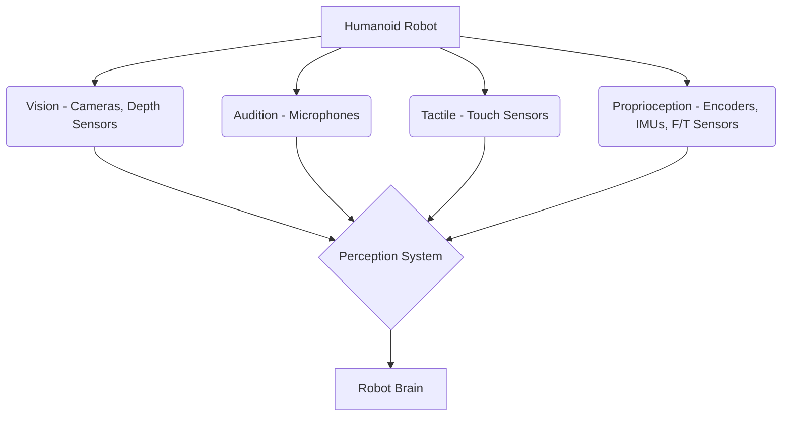

## 3.1 The Role of Sensors in Robotics

Sensors are the eyes, ears, and touch of a robot, providing the necessary data for it to understand its environment and its own state. Accurate and reliable sensor data is crucial for any intelligent robotic system to perceive, navigate, and interact with the physical world. Without effective sensing, a robot is blind and deaf to its surroundings.

**Types of Sensors:**
*   **Proprioceptive Sensors:** Measure the robot's internal state (e.g., joint encoders for position, IMUs for orientation, force/torque sensors).
*   **Exteroceptive Sensors:** Measure the robot's external environment (e.g., cameras, LiDAR, ultrasonic sensors, microphones).

**Diagram: Sensor Modalities in a Humanoid Robot**



## 3.2 Vision-based Perception

Vision systems are paramount for robots to interpret visual information from their surroundings. This includes object detection, recognition, tracking, and 3D scene reconstruction.

**Key Techniques:**
*   **Object Detection:** Identifying and localizing objects in an image (e.g., YOLO, Faster R-CNN).
*   **Semantic Segmentation:** Classifying each pixel in an image to a specific object class.
*   **3D Reconstruction:** Using stereo cameras or depth sensors (e.g., Intel RealSense, Microsoft Kinect) to build a 3D map of the environment.

**ROS2 Code Example: Camera Image Subscriber**

This ROS2 example shows how to subscribe to an image topic, typically from a camera, and process it using OpenCV.

```python
import rclpy
from rclpy.node import Node
from sensor_msgs.msg import Image
from cv_bridge import CvBridge
import cv2

class ImageSubscriber(Node):
    def __init__(self):
        super().__init__('image_subscriber')
        self.subscription = self.create_subscription(
            Image, '/camera/image_raw', self.listener_callback, 10)
        self.subscription # prevent unused variable warning
        self.br = CvBridge()

    def listener_callback(self, data):
        self.get_logger().info('Receiving video frame')
        current_frame = self.br.imgmsg_to_cv2(data)

        # Example: Convert to grayscale and display
        gray_frame = cv2.cvtColor(current_frame, cv2.COLOR_BGR2GRAY)
        cv2.imshow("Camera Feed (Grayscale)", gray_frame)
        cv2.waitKey(1)

def main(args=None):
    rclpy.init(args=args)
    image_subscriber = ImageSubscriber()
    rclpy.spin(image_subscriber)
    cv2.destroyAllWindows()
    image_subscriber.destroy_node()
    rclpy.shutdown()

if __name__ == '__main__':
    main()
```
*Explanation*: This node subscribes to an `Image` message, converts it to an OpenCV image using `CvBridge`, and then displays a grayscale version. This forms the basis for any vision-based processing in a ROS2 robot.

## 3.3 LiDAR and Depth Sensing

LiDAR (Light Detection and Ranging) sensors and depth cameras provide distance measurements, crucial for obstacle avoidance, mapping, and localization. They generate point clouds or depth maps that represent the 3D structure of the environment.

**Applications:**
*   **SLAM (Simultaneous Localization and Mapping):** Building a map of an unknown environment while simultaneously tracking the robot's position within it.
*   **Obstacle Avoidance:** Detecting nearby objects and planning collision-free paths.
*   **Navigation:** Providing detailed spatial information for path planning.

## 3.4 Force and Tactile Sensing

Force/torque sensors at robot wrists and tactile sensors on grippers or robot skin provide crucial information for manipulation and human-robot interaction. They allow robots to detect contact, grasp objects with appropriate force, and perform delicate tasks.

**Importance:**
*   **Safe Interaction:** Prevents excessive force during contact with humans or delicate objects.
*   **Dexterous Manipulation:** Enables robots to handle objects with varying stiffness and fragility.
*   **Collision Detection:** Provides immediate feedback upon unexpected contact.

## 3.5 Sensor Fusion

Combining data from multiple sensors (sensor fusion) is vital to overcome the limitations of individual sensors and create a more robust and comprehensive understanding of the environment. Techniques like Kalman filters and particle filters are commonly used for this purpose.

**Benefits:**
*   Improved accuracy and reliability.
*   Robustness to sensor noise and failures.
*   More complete environmental understanding.

## 3.6 Simulation Steps: Object Detection in Gazebo

1.  **Gazebo World Setup:** Create a Gazebo world with various objects (models) for the robot to perceive.
2.  **Camera/LiDAR Integration:** Add camera or LiDAR sensors to the robot's URDF/SDF model within Gazebo, ensuring they publish relevant ROS2 topics (e.g., `/camera/image_raw`, `/scan`).
3.  **Perception Algorithm:** Implement a ROS2 node (like the `ImageSubscriber` above, but with actual object detection logic) that subscribes to sensor topics.
4.  **Visualize Results:** Display bounding boxes or detected object labels in an RViz (ROS Visualization) window or directly in Gazebo.

## Chapter Summary

Chapter 3 explored the critical role of sensors and perception in robotics. We discussed various sensor types, detailed vision-based perception techniques, and highlighted the importance of LiDAR, depth, force, and tactile sensing. The concept of sensor fusion for robust environmental understanding was introduced, alongside practical simulation steps and a ROS2 code example for subscribing to and processing camera images, laying the groundwork for how robots 'see' and interpret their world.
