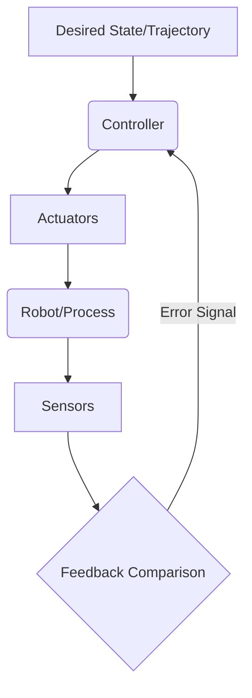

## 4.1 Fundamentals of Robot Control

Robot control systems are designed to ensure that a robot executes desired motions and tasks accurately and robustly, despite disturbances and uncertainties in the environment. At its core, control involves comparing a robot's actual state (measured by sensors) to a desired state and then calculating corrective actions (commands to actuators) to minimize the error.

**Key Elements of a Control System:**
*   **Desired Trajectory:** The planned path and timing for the robot's movement.
*   **Sensors:** Provide feedback on the robot's current state.
*   **Controller:** Computes actuator commands based on error.
*   **Actuators:** Execute the commands to move the robot.

**Diagram: Basic Feedback Control Loop**



## 4.2 Joint-Space Control

Joint-space control involves commanding and controlling each of the robot's joints independently. This is often simpler for tasks where the exact end-effector trajectory isn't critical, or for point-to-point movements. Common joint controllers include PID (Proportional-Integral-Derivative) controllers.

**PID Controller Overview:**
*   **Proportional (P):** Responds to the current error.
*   **Integral (I):** Responds to the accumulated error over time, helping to eliminate steady-state error.
*   **Derivative (D):** Responds to the rate of change of the error, helping to dampen oscillations and improve stability.

**Mathematical Form of PID:**

```latex
U(t) = K_p e(t) + K_i \int_{0}^{t} e(\tau) d\tau + K_d \frac{de(t)}{dt}
```
Where:
*   $U(t)$: Control output (e.g., motor torque)
*   $e(t)$: Error (desired state - actual state)
*   $K_p, K_i, K_d$: Proportional, Integral, and Derivative gains

## 4.3 Task-Space Control (Cartesian Control)

Task-space control (also known as Cartesian control) directly controls the position and orientation of the robot's end-effector in Cartesian coordinates. This is essential for tasks requiring precise interaction with the environment, such as grasping objects or following a contour. It typically involves an inner joint-space control loop and an outer task-space control loop.

**Challenges:**
*   Requires inverse kinematics or Jacobian-based methods to convert Cartesian commands to joint commands.
*   Dealing with singularities in the robot's workspace.

## 4.4 Advanced Control Techniques

*   **Adaptive Control:** Adjusts controller parameters in real-time to compensate for changes in robot dynamics or environmental uncertainties.
*   **Robust Control:** Designs controllers that maintain performance despite model uncertainties and disturbances.
*   **Optimal Control:** Aims to find a control policy that optimizes a specific performance criterion (e.g., minimum energy, minimum time).
*   **Learning-based Control:** Uses machine learning (e.g., reinforcement learning) to learn control policies, particularly effective for complex, dynamic tasks.

## 4.5 Simulation Steps: PID Joint Control

1.  **Robot Model:** Ensure your URDF/SDF defines movable joints with their limits and dynamics properties.
2.  **Controller Configuration:** In a simulator like Gazebo, configure PID controllers for each joint, typically defined in a YAML file or directly in the URDF/SDF.
3.  **ROS2 Joint State Publisher:** A node that publishes the current joint positions (often provided by the simulator).
4.  **ROS2 Joint Command Subscriber:** A node that subscribes to desired joint positions (e.g., from a high-level planner) and feeds them to the PID controllers.
5.  **Tuning:** Adjust $K_p, K_i, K_d$ gains until the robot moves smoothly and accurately to desired joint positions.

**ROS2 Code Example: Simple PID Joint Controller (Conceptual)**

While ROS2 offers controllers like `joint_trajectory_controller`, a conceptual Python example for a single joint PID loop might look like this (for direct simulation integration):

```python
# This is a conceptual example for a single joint PID controller.
# In a real ROS2 system, you'd typically use a pre-built controller like joint_state_controller
# or joint_trajectory_controller and configure it via YAML.

import rclpy
from rclpy.node import Node
from std_msgs.msg import Float64
from sensor_msgs.msg import JointState

class PidJointController(Node):
    def __init__(self):
        super().__init__('pid_joint_controller')
        self.declare_parameter('Kp', 10.0)
        self.declare_parameter('Ki', 0.1)
        self.declare_parameter('Kd', 0.5)
        self.declare_parameter('target_joint_angle', 0.0)

        self.Kp = self.get_parameter('Kp').value
        self.Ki = self.get_parameter('Ki').value
        self.Kd = self.get_parameter('Kd').value
        self.target_angle = self.get_parameter('target_joint_angle').value

        self.current_angle = 0.0
        self.error_sum = 0.0
        self.last_error = 0.0
        self.last_time = self.get_clock().now()

        self.joint_state_sub = self.create_subscription(
            JointState, 'joint_states', self.joint_state_callback, 10)
        self.cmd_pub = self.create_publisher(Float64, 'joint_cmd_torque', 10) # Or position/velocity
        self.timer = self.create_timer(0.01, self.control_loop_callback) # 100 Hz control loop

    def joint_state_callback(self, msg):
        # Assuming 'joint1' is the joint we are controlling
        if 'joint1' in msg.name:
            joint_index = msg.name.index('joint1')
            self.current_angle = msg.position[joint_index]

    def control_loop_callback(self):
        current_time = self.get_clock().now()
        dt = (current_time - self.last_time).nanoseconds / 1e9
        if dt == 0: return

        error = self.target_angle - self.current_angle
        self.error_sum += error * dt
        error_derivative = (error - self.last_error) / dt

        output = (self.Kp * error) + (self.Ki * self.error_sum) + (self.Kd * error_derivative)

        cmd_msg = Float64()
        cmd_msg.data = output
        self.cmd_pub.publish(cmd_msg)

        self.last_error = error
        self.last_time = current_time

def main(args=None):
    rclpy.init(args=args)
    pid_controller = PidJointController()
    rclpy.spin(pid_controller)
    pid_controller.destroy_node()
    rclpy.shutdown()

if __name__ == '__main__':
    main()
```
*Explanation*: This conceptual ROS2 node implements a basic PID controller. It subscribes to `joint_states` to get the current angle of a specified joint, calculates the error against a target angle, and publishes a control output (e.g., torque or position command) to another topic. This output would then be consumed by the robot's low-level hardware interface or a simulator's joint driver.

## Chapter Summary

Chapter 4 provided a comprehensive look into robot control systems, beginning with the fundamentals of feedback control. We differentiated between joint-space and task-space control, focusing on the widely used PID controller for joint-level regulation. The chapter also touched upon advanced control strategies and detailed the simulation steps involved in implementing PID joint control, including a conceptual ROS2 code example. This knowledge is essential for ensuring robots execute their motions accurately and reliably.
