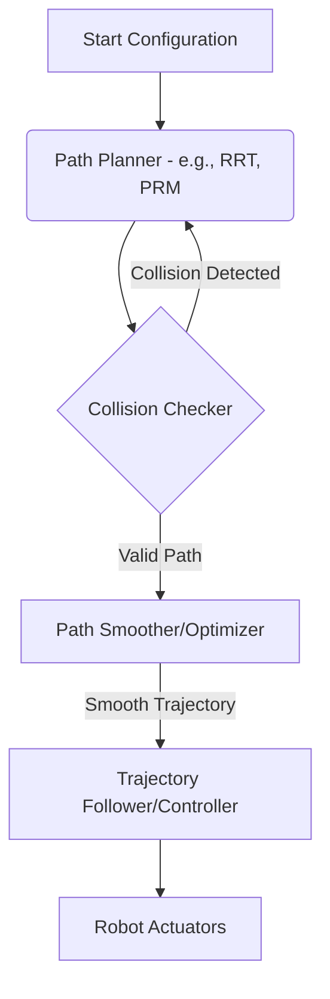

## 5.1 Introduction to Motion Planning

Motion planning is the process of finding a sequence of valid robot configurations (a path or trajectory) from a start state to a goal state while avoiding obstacles and respecting robot constraints. It's a crucial capability for autonomous robots operating in complex and dynamic environments, enabling them to move intelligently without collisions.

**Key Aspects:**
*   **Configuration Space (C-space):** A representation of all possible configurations of a robot, where each configuration corresponds to a single point.
*   **Obstacle Avoidance:** Ensuring the robot's path does not intersect with any obstacles.
*   **Path vs. Trajectory:** A path is a sequence of configurations, while a trajectory includes timing information (velocities and accelerations).

**Diagram: Motion Planning Overview**



## 5.2 Path Planning Algorithms

Various algorithms exist to find paths in a robot's configuration space. These can be broadly categorized into sampling-based and graph-based methods.

### Sampling-Based Algorithms
*   **Rapidly-exploring Random Tree (RRT/RRT*):** Builds a tree by randomly sampling points in C-space and connecting them to the nearest node in the tree. RRT* offers optimality guarantees.
*   **Probabilistic Roadmaps (PRM):** Constructs a roadmap (graph) of collision-free configurations and then uses graph search algorithms (e.g., Dijkstra, A*) to find a path.

### Graph-Based Algorithms
*   **Dijkstra's Algorithm / A* Search:** Find the shortest path on a discrete graph (e.g., a grid map of the environment).
*   **Visibility Graphs:** Connect obstacle vertices if the line segment between them is collision-free.

## 5.3 Local vs. Global Planning

*   **Global Planning:** Computes a complete path from start to goal based on a full map of the environment. Often computationally intensive but provides optimal or near-optimal paths.
*   **Local Planning:** Generates short-term movements based on immediate sensor readings. Essential for reactive obstacle avoidance and adapting to dynamic environments.

## 5.4 Robot Navigation

Robot navigation integrates motion planning with localization and mapping to enable a robot to move autonomously in an environment. This often involves the `navigation2` (Nav2) stack in ROS2.

**Key Components of Nav2 (Conceptual):**
*   **Localization:** Determining the robot's position and orientation in a map (e.g., AMCL for LiDAR-based, Particle Filter for general).
*   **Mapping:** Building a representation of the environment (e.g., `slam_toolbox`).
*   **Path Planning:** Global and local planners.
*   **Control:** Executing the planned trajectories.

## 5.5 Simulation Steps: Autonomous Navigation in Gazebo

1.  **Gazebo World & Robot Setup:** Launch a Gazebo world with a map, and a robot model equipped with a LiDAR sensor and differential drive (for mobile robots).
2.  **ROS2 Navigation Stack:** Launch the `navigation2` stack, configured with global and local planners, costmaps, and controllers.
3.  **SLAM (Optional):** If a map is not provided, use `slam_toolbox` to build a map while driving the robot manually.
4.  **Localization:** Use AMCL (`adaptive_monte_carlo_localization`) to localize the robot within the map.
5.  **Goal Setting:** Send navigation goals (2D poses) to the Nav2 stack via RViz or a ROS2 client.
6.  **Observe Navigation:** Watch the robot autonomously plan and execute its path while avoiding obstacles.

**ROS2 Code Example: Sending a Navigation Goal with Nav2**

This example demonstrates how to send a simple navigation goal to the `navigation2` stack in ROS2.

```python
import rclpy
from rclpy.node import Node
from geometry_msgs.msg import PoseStamped
from nav2_simple_commander.robot_navigator import BasicNavigator
import time

class GoalSender(Node):
    def __init__(self):
        super().__init__('goal_sender')
        self.navigator = BasicNavigator()
        self.get_logger().info("Waiting for Nav2 services...")
        self.navigator.waitForPose()
        self.get_logger().info("Nav2 services ready.")

    def send_goal(self, x, y, yaw):
        goal_pose = PoseStamped()
        goal_pose.header.frame_id = 'map' # Assuming your map frame is 'map'
        goal_pose.header.stamp = self.get_clock().now().to_msg()
        goal_pose.pose.position.x = x
        goal_pose.pose.position.y = y
        # For 2D navigation, orientation Z and W specify yaw
        goal_pose.pose.orientation.z = math.sin(yaw / 2.0)
        goal_pose.pose.orientation.w = math.cos(yaw / 2.0)

        self.get_logger().info(f'Sending goal: x={x}, y={y}, yaw={yaw}')
        self.navigator.goToPose(goal_pose)

        while not self.navigator.isTaskComplete():
            feedback = self.navigator.getFeedback()
            if feedback:
                self.get_logger().info(f'Distance remaining: {feedback.distance_remaining}m')
            time.sleep(1.0)

        result = self.navigator.getResult()
        if result == BasicNavigator.RESULT_SUCCEEDED:
            self.get_logger().info('Goal succeeded!')
        else:
            self.get_logger().warn('Goal failed!')

def main(args=None):
    rclpy.init(args=args)
    goal_sender = GoalSender()

    # Example: Send robot to (1.0, 1.0) with 90 degree yaw
    goal_sender.send_goal(1.0, 1.0, math.pi / 2.0)

    goal_sender.destroy_node()
    rclpy.shutdown()

if __name__ == '__main__':
    import math # Required for math.sin and math.cos
    main()
```
*Explanation*: This ROS2 node uses `nav2_simple_commander` to simplify interaction with the `navigation2` stack. It creates a `BasicNavigator` instance, waits for the Nav2 services to become active, and then sends a `PoseStamped` message representing the desired goal (x, y, and yaw). It then monitors the task completion and provides feedback.

## Chapter Summary

Chapter 5 covered the crucial area of motion planning and navigation for robots. We explored various path planning algorithms, distinguishing between sampling-based and graph-based approaches, and discussed the interplay between global and local planning. The chapter detailed the components of a typical navigation stack like `navigation2` in ROS2 and provided simulation steps for autonomous navigation, concluding with a ROS2 code example for sending navigation goals. This knowledge empowers robots to move intelligently and safely in their environments.
