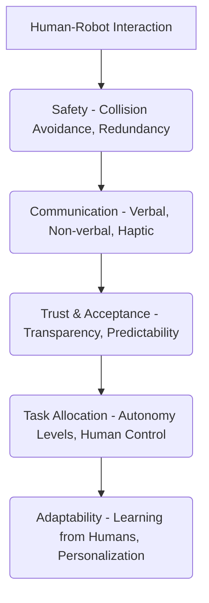

## 6.1 Principles of Human-Robot Interaction (HRI)

Human-Robot Interaction (HRI) is the study of how humans and robots can effectively and safely work together and communicate. As robots move from isolated industrial environments to homes, workplaces, and public spaces, designing intuitive, safe, and trustworthy interactions becomes paramount. HRI encompasses psychology, cognitive science, robotics, and design principles.

**Core Principles:**
*   **Safety:** Ensuring physical and psychological well-being of humans during interaction.
*   **Trust:** Building reliability and predictability in robot behavior.
*   **Intuitiveness:** Designing interactions that are easy to understand and use without extensive training.
*   **Efficiency:** Optimizing tasks for both human and robot performance.
*   **Adaptability:** Robots adjusting their behavior to human cues and preferences.

**Diagram: HRI Design Considerations**



## 6.2 Communication in HRI

Effective communication is the cornerstone of successful HRI. Robots can communicate with humans through various modalities.

### Verbal Communication
*   **Speech Synthesis (Text-to-Speech):** Generating spoken language from text.
*   **Speech Recognition (Automatic Speech Recognition - ASR):** Converting spoken language into text.
*   **Natural Language Understanding (NLU):** Interpreting the meaning and intent behind human speech.

### Non-Verbal Communication
*   **Gestures:** Using robot arms, head, or body to convey meaning (e.g., pointing, waving).
*   **Facial Expressions (for humanoids):** Displaying emotions or intentions through synthetic faces.
*   **Gaze:** Directing attention to objects or humans.
*   **Haptic Feedback:** Vibrations or forces to communicate touch or alerts.

## 6.3 Levels of Robot Autonomy

The level of autonomy a robot possesses significantly impacts HRI. Autonomy can range from teleoperation (human-controlled) to full robot autonomy.

*   **Teleoperation:** Human directly controls robot movements.
*   **Shared Autonomy:** Human and robot collaborate, with the robot assisting in tasks.
*   **Supervised Autonomy:** Robot operates autonomously but reports to a human supervisor for decisions.
*   **Full Autonomy:** Robot operates without direct human intervention, making all decisions.

## 6.4 Collaborative Robots (Cobots)

Cobots are designed to work in close proximity to humans, often sharing the same workspace without safety cages. Their development is driven by advanced safety features, compliant control, and intuitive programming interfaces, enabling them to assist humans in assembly, material handling, and other tasks.

**Safety Features:**
*   **Force/Torque Sensing:** Detecting contact and stopping or yielding.
*   **Collision Detection:** Algorithms to anticipate and avoid collisions.
*   **Speed and Separation Monitoring:** Adjusting speed based on human proximity.

## 6.5 Ethical Considerations in HRI

As robots become more integrated into society, ethical considerations become critical:
*   **Privacy:** Data collection by robots (e.g., cameras, microphones).
*   **Accountability:** Who is responsible when a robot makes an error or causes harm?
*   **Bias:** Ensuring AI algorithms controlling robots are fair and unbiased.
*   **Job Displacement:** Impact on human employment.
*   **Human Dignity:** Avoiding objectification or dehumanization of robots.

## 6.6 Simulation Steps: Collaborative Task with ROS2

1.  **Gazebo World:** Create a shared workspace environment in Gazebo with a human model (or a representation thereof) and a cobot.
2.  **ROS2 Control:** Launch the cobot with ROS2 controllers (e.g., `ros2_control`) for joint position or velocity commands.
3.  **HRI Planner:** Implement a ROS2 node that plans simple collaborative tasks, considering shared workspaces and safety zones.
4.  **Perception:** Use simulated camera/depth data to detect the human's presence and gestures.
5.  **Interaction:** The robot adjusts its path or speed in response to human proximity or simple verbal commands (simulated).

**ROS2 Code Example: Simple Human Proximity Detection (Conceptual)**

This conceptual example shows a ROS2 node that reacts to a simulated human presence by stopping the robot, using a simplified distance sensor.

```python
# This is a conceptual example. Actual human detection often uses complex vision/LiDAR.

import rclpy
from rclpy.node import Node
from std_msgs.msg import Float32
from geometry_msgs.msg import Twist

class HumanProximityDetector(Node):
    def __init__(self):
        super().__init__('human_proximity_detector')
        self.subscription = self.create_subscription(
            Float32, 'distance_sensor_topic', self.distance_callback, 10)
        self.publisher_ = self.create_publisher(Twist, 'cmd_vel', 10)
        self.robot_stopped = False

    def distance_callback(self, msg):
        human_distance = msg.data
        safe_distance = 0.5 # meters

        twist_msg = Twist()

        if human_distance < safe_distance:
            if not self.robot_stopped:
                self.get_logger().warn('Human detected too close! Stopping robot.')
                twist_msg.linear.x = 0.0
                twist_msg.angular.z = 0.0
                self.publisher_.publish(twist_msg)
                self.robot_stopped = True
        else:
            if self.robot_stopped:
                self.get_logger().info('Human moved away. Resuming robot movement.')
                self.robot_stopped = False
                # You would typically resume previous motion here, or signal a planner.
                # For this example, we just don't send a stop command.

def main(args=None):
    rclpy.init(args=args)
    detector = HumanProximityDetector()
    rclpy.spin(detector)
    detector.destroy_node()
    rclpy.shutdown()

if __name__ == '__main__':
    main()
```
*Explanation*: This conceptual ROS2 node subscribes to a `Float32` message representing distance to a human. If the human is too close, it publishes a `Twist` message with zero linear and angular velocities to `cmd_vel`, effectively stopping a mobile robot. In a real scenario, `distance_sensor_topic` would come from processed sensor data (e.g., LiDAR or camera-based human tracking).

## Chapter Summary

Chapter 6 explored the multifaceted field of Human-Robot Interaction (HRI), covering its core principles, various communication modalities (verbal and non-verbal), and different levels of robot autonomy. We discussed collaborative robots (cobots) and their critical safety features, along with important ethical considerations. The chapter concluded with simulation steps for collaborative tasks and a conceptual ROS2 code example for human proximity detection, emphasizing the importance of safe and intuitive robot interactions.
