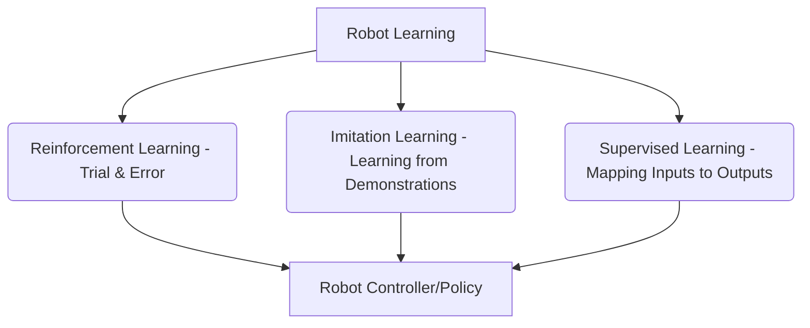

## 7.1 Introduction to Robot Learning

Traditional robotics relies on explicit programming for tasks, which can be brittle in complex or unstructured environments. Robot learning, particularly through machine learning paradigms like Reinforcement Learning (RL) and Imitation Learning (IL), offers a powerful alternative. These methods enable robots to acquire skills and adapt behaviors autonomously from experience or human demonstrations, making them more versatile and robust.

**Why Learning?**
*   **Adaptability:** Robots can adjust to novel situations and uncertainties.
*   **Scalability:** Avoids exhaustive manual programming for complex tasks.
*   **Emergent Behaviors:** Can discover non-intuitive, optimal strategies.

**Diagram: Robot Learning Paradigms**



## 7.2 Reinforcement Learning for Robotics

Reinforcement Learning (RL) allows a robot (the agent) to learn optimal behaviors by interacting with its environment and receiving reward signals. The agent learns a policy that maps states to actions, aiming to maximize cumulative reward over time.

**Key Components:**
*   **Agent:** The robot learning to act.
*   **Environment:** The physical world or simulation the robot interacts with.
*   **State:** The current observation of the environment.
*   **Action:** The control command the robot executes.
*   **Reward:** A scalar feedback signal indicating the desirability of an action or state.
*   **Policy:** A strategy that maps states to actions.

**Common RL Algorithms:**
*   **Q-learning:** Value-based method for finding an optimal action-value function.
*   **Deep Q-Networks (DQN):** Extends Q-learning with deep neural networks for large state spaces.
*   **Policy Gradients (e.g., REINFORCE, A2C, PPO):** Directly optimizes the policy to maximize rewards.
*   **Model-Based RL:** Learns a model of the environment to plan and optimize policies.

## 7.3 Imitation Learning (Learning from Demonstration)

Imitation Learning (IL), also known as Learning from Demonstration (LfD), enables robots to learn skills by observing human demonstrations. Instead of explicitly programming, the robot attempts to mimic the demonstrated behavior. This is particularly useful when designing a reward function for RL is difficult or when safety requires human supervision.

**Approaches:**
*   **Behavioral Cloning:** A supervised learning approach where a neural network directly maps observations from human demonstrations to actions.
*   **Inverse Reinforcement Learning (IRL):** Infers the reward function that best explains the demonstrated behavior.
*   **Generative Adversarial Imitation Learning (GAIL):** Uses a generative adversarial network to learn a policy that can't be distinguished from the demonstrator's policy.

## 7.4 Simulation Steps: Training an RL Agent for Locomotion

1.  **Simulator Environment:** Use a physics simulator (e.g., Gazebo, MuJoCo, Isaac Gym) to create a robot locomotion environment (e.g., walking, running).
2.  **Define State, Action, Reward:** Clearly specify the robot's observable state (joint angles, velocities, IMU data), action space (joint torques/positions), and a reward function that encourages desired locomotion (e.g., forward velocity, minimal energy consumption).
3.  **RL Framework:** Integrate a deep RL framework (e.g., Stable Baselines3, Ray RLLib) with the simulator, often through an OpenAI Gym-like interface.
4.  **Training:** Run the RL algorithm for millions of simulation steps, allowing the robot to explore and learn through trial and error.
5.  **Policy Deployment:** Once a satisfactory policy is learned, deploy it to the simulated robot and observe its learned behavior.

**ROS2 & Python Code Example: Simple RL Environment Interface (Conceptual)**

This conceptual example illustrates how a ROS2 node might interface with a simulated environment for RL training. A full RL setup is extensive.

```python
# This is a highly simplified conceptual example to show the interface.
# A real RL environment would be much more complex and integrate with a simulator.

import rclpy
from rclpy.node import Node
from std_msgs.msg import Float32MultiArray
from std_srvs.srv import Empty

class RlEnvironmentInterface(Node):
    def __init__(self):
        super().__init__('rl_environment_interface')
        self.observation_publisher = self.create_publisher(Float32MultiArray, 'robot_observations', 10)
        self.action_subscriber = self.create_subscription(
            Float32MultiArray, 'robot_actions', self.action_callback, 10)
        self.reset_service = self.create_service(Empty, 'reset_environment', self.reset_callback)

        self.current_state = [0.0, 0.0, 0.0] # Dummy initial state
        self.timer = self.create_timer(0.1, self.publish_observation) # Simulate environment update

    def publish_observation(self):
        # In a real scenario, this would read sensor data from simulator/robot
        msg = Float32MultiArray()
        # Simulate state change for demonstration
        self.current_state[0] += 0.01
        self.current_state[1] = math.sin(self.current_state[0])
        self.current_state[2] = math.cos(self.current_state[0])
        msg.data = self.current_state
        self.observation_publisher.publish(msg)
        self.get_logger().info(f'Publishing observation: {msg.data}')

    def action_callback(self, msg):
        # In a real scenario, this would send commands to robot/simulator actuators
        self.get_logger().info(f'Received action: {msg.data}')
        # Process action, update environment (e.g., move robot), calculate reward
        # For simplicity, we just print the action.

    def reset_callback(self, request, response):
        self.get_logger().info('Resetting environment...')
        self.current_state = [0.0, 0.0, 0.0] # Reset to initial state
        # In a real scenario, this would reset the simulator/robot position
        return response

def main(args=None):
    rclpy.init(args=args)
    node = RlEnvironmentInterface()
    rclpy.spin(node)
    node.destroy_node()
    rclpy.shutdown()

if __name__ == '__main__':
    import math # Required for math functions
    main()
```
*Explanation*: This conceptual ROS2 node acts as a bridge between an RL agent (not shown here) and a simulated robot environment. It publishes `robot_observations` (state), subscribes to `robot_actions`, and provides a `reset_environment` service. A separate RL training script would consume observations, compute actions, and send them back, interacting with this node to train a policy.

## Chapter Summary

Chapter 7 explored the transformative field of robot learning, focusing on Reinforcement Learning (RL) and Imitation Learning (IL). We detailed the core components and algorithms of RL, from Q-learning to policy gradients, and examined IL approaches like behavioral cloning. The chapter provided a comprehensive overview of how these paradigms enable robots to acquire skills autonomously from experience or human demonstrations, outlining simulation steps for training an RL agent and a conceptual ROS2 interface for an RL environment. This chapter highlights the frontier of creating truly intelligent and adaptive robotic systems.
