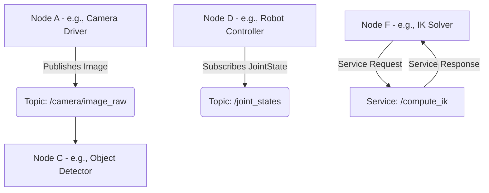

## 8.1 Introduction to ROS2

ROS2 (Robot Operating System 2) is a flexible framework for writing robot software. It provides a collection of tools, libraries, and conventions that aim to simplify the task of creating complex and robust robot applications. Building on the success of ROS1, ROS2 is re-architected to meet the demands of modern robotics, including real-time performance, multi-robot systems, and embedded platforms.

**Key Concepts:**
*   **Nodes:** Executable processes that perform computation (e.g., a camera driver, a motor controller).
*   **Topics:** A message bus over which nodes exchange data asynchronously (publish/subscribe).
*   **Services:** Request/reply communication mechanism for synchronous calls.
*   **Actions:** Long-running, preemptable tasks with feedback (e.g., navigating to a goal).
*   **Messages:** Data structures for communication.
*   **Packages:** Units for organizing ROS2 code (nodes, messages, libraries).

**Diagram: ROS2 Communication Graph**



## 8.2 Setting up a ROS2 Workspace

A ROS2 workspace is a directory where you develop, build, and install your ROS2 packages. It helps manage dependencies and ensures your custom code can be found by the ROS2 system.

**Steps:**
1.  **Create Workspace:** `mkdir -p ~/ros2_ws/src`
2.  **Navigate to src:** `cd ~/ros2_ws/src`
3.  **Clone Packages (Optional):** `git clone <your_repo_url>`
4.  **Build Workspace:** `cd ~/ros2_ws && colcon build` (from workspace root)
5.  **Source Setup File:** `source install/setup.bash` (or `.ps1` for Windows, `.zsh` for Zsh) - this makes your packages visible.

## 8.3 Creating a ROS2 Package

Creating a custom package is the first step to writing your own ROS2 applications. You can use `ros2 pkg create`.

```bash
# Create a Python package
ros2 pkg create --build-type ament_python my_robot_pkg

# Create a C++ package
ros2 pkg create --build-type ament_cmake my_cpp_pkg
```

This creates a directory with basic structure, `package.xml` (metadata), and `CMakeLists.txt` (for C++) or `setup.py` (for Python).

## 8.4 Implementing ROS2 Nodes

Nodes are the fundamental computational units in ROS2. They can be written in C++ or Python.

**Python Node Example (Minimal Publisher):**

```python
# my_robot_pkg/my_robot_pkg/minimal_publisher.py

import rclpy
from rclpy.node import Node
from std_msgs.msg import String

class MinimalPublisher(Node):
    def __init__(self):
        super().__init__('minimal_publisher')
        self.publisher_ = self.create_publisher(String, 'topic', 10)
        timer_period = 0.5  # seconds
        self.timer = self.create_timer(timer_period, self.timer_callback)
        self.i = 0

    def timer_callback(self):
        msg = String()
        msg.data = f'Hello, ROS2! {self.i}'
        self.publisher_.publish(msg)
        self.get_logger().info(f'Publishing: "{msg.data}"')
        self.i += 1

def main(args=None):
    rclpy.init(args=args)
    minimal_publisher = MinimalPublisher()
    rclpy.spin(minimal_publisher)
    minimal_publisher.destroy_node()
    rclpy.shutdown()

if __name__ == '__main__':
    main()
```

To make this executable and installable, you need to add an entry point in `my_robot_pkg/setup.py`:

```python
# setup.py (relevant part)
setup(
    # ... other metadata ...
    entry_points={
        'console_scripts': [
            'talker = my_robot_pkg.minimal_publisher:main',
        ],
    },
)
```

## 8.5 Using ROS2 Launch Files

Launch files are XML or Python scripts used to start multiple ROS2 nodes and configure parameters simultaneously. This simplifies the deployment of complex robotic systems.

**Python Launch File Example (`my_robot_pkg/launch/my_example_launch.py`):**

```python
from launch import LaunchDescription
from launch_ros.actions import Node

def generate_launch_description():
    return LaunchDescription([
        Node(
            package='my_robot_pkg',
            executable='talker',
            name='my_publisher',
            output='screen',
            parameters=[
                {'param_name': 'param_value'}
            ]
        ),
        Node(
            package='my_robot_pkg',
            executable='listener',
            name='my_subscriber',
            output='screen',
        )
    ])
```

To run this launch file: `ros2 launch my_robot_pkg my_example_launch.py`

## 8.6 Simulation Steps: Integrating with Gazebo and RViz

1.  **Robot Description (URDF/XACRO):** Create a detailed model of your robot, including its links, joints, sensors, and physical properties.
2.  **Gazebo Simulation:** Launch a Gazebo world and spawn your robot using the robot description. Gazebo provides physics simulation and realistic sensor data.
3.  **ROS2 Bridges:** Use `ros2_control` and `ros2_controllers` to connect Gazebo's physics engine to ROS2 topics for joint commands and sensor feedback.
4.  **RViz Visualization:** Launch RViz2 (ROS Visualization) to visualize the robot model, sensor data (e.g., point clouds, camera images), planned paths, and robot state in a 3D environment.
5.  **Run Your Nodes:** Start your custom ROS2 nodes (e.g., perception, control, navigation) that interact with the simulated robot.

## Chapter Summary

Chapter 8 provided a comprehensive guide to Robotics Software with ROS2, introducing its core concepts like nodes, topics, services, and actions. We covered setting up a ROS2 workspace, creating custom packages in Python and C++, and implementing ROS2 nodes for communication. The chapter also detailed the use of ROS2 launch files for managing multiple nodes and outlined the steps for integrating ROS2 applications with Gazebo and RViz for simulation and visualization, equipping readers with the essential tools for building advanced robotic systems.
