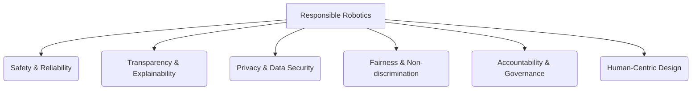

## 9.1 Ethical Considerations in Physical AI and Humanoid Robotics

As physical AI and humanoid robots become more sophisticated and integrated into society, a range of complex ethical challenges arise. Addressing these proactively is crucial for responsible development and public trust. The discussions often revolve around safety, autonomy, privacy, accountability, and the societal impact of advanced robotics.

**Key Ethical Dilemmas:**
*   **Safety and Malfunction:** Who is liable when an autonomous robot causes harm due to malfunction or unforeseen behavior?
*   **Privacy and Surveillance:** Robots with advanced sensors (cameras, microphones) raise concerns about constant data collection in private spaces.
*   **Autonomy and Control:** To what extent should robots be allowed to make independent decisions, especially in critical situations?
*   **Bias and Discrimination:** AI algorithms can inherit and amplify biases present in their training data, leading to unfair or discriminatory robot behaviors.
*   **Job Displacement:** The increasing capabilities of robots could lead to significant changes in employment landscapes.
*   **Human Dignity and Relationships:** The potential for emotional attachment to humanoids, and their role in caregiving or companionship, raises questions about human authenticity and emotional well-being.

**Diagram: Pillars of Responsible Robotics**

## 9.2 Regulatory and Policy Frameworks

Governments and international bodies are beginning to develop regulatory frameworks to guide the development and deployment of AI and robotics. These often aim to foster innovation while mitigating risks.

*   **AI Ethics Guidelines:** Many countries and organizations have published guidelines emphasizing human oversight, technical robustness, privacy, and fairness.
*   **Robot Laws:** Emerging discussions about specific legislation for robots, potentially covering liability, rights, and responsibilities.
*   **Standardization:** Developing technical standards for robot safety, interoperability, and testing.

## 9.3 The Future of Humanoid Robotics

The trajectory of humanoid robotics points towards increasingly capable, versatile, and autonomous machines. Future developments are likely to focus on:

*   **Enhanced Dexterity and Manipulation:** Robots performing intricate tasks with human-level or superhuman dexterity.
*   **Advanced Locomotion:** More agile and robust movement over diverse terrains.
*   **Cognitive Abilities:** Improved reasoning, common sense, and natural language understanding for complex decision-making.
*   **Soft Robotics:** Utilizing compliant materials for safer and more adaptable interaction.
*   **Bio-inspired Robotics:** Drawing inspiration from biological systems for novel designs and control strategies.

## 9.4 Societal Impact and Vision

The long-term societal impact of physical AI and humanoids is a subject of ongoing debate. While they hold immense potential to address labor shortages, assist the elderly, perform dangerous tasks, and enhance productivity, concerns about economic disruption, ethical misuse, and the fundamental nature of human work and interaction persist.

**Potential Positive Impacts:**
*   Increased productivity and economic growth.
*   Improved quality of life (e.g., assistive robotics).
*   Safer workplaces (robots in hazardous environments).
*   New avenues for scientific discovery.

**Potential Challenges:**
*   Ethical unemployment and wealth distribution.
*   Algorithmic bias and discrimination.
*   Security vulnerabilities and potential for misuse.
*   Erosion of human skills or social interaction.

## 9.5 Preparing for an AI-Robot Future

*   **Education:** Equipping the workforce with skills relevant to developing, managing, and working alongside robots.
*   **Public Dialogue:** Fostering informed public discussions about the benefits and risks of advanced robotics.
*   **Interdisciplinary Research:** Encouraging collaboration between engineers, ethicists, social scientists, and policymakers.
*   **Adaptive Governance:** Developing flexible regulatory frameworks that can evolve with technological advancements.

## Chapter Summary

Chapter 9 explored the critical ethical dimensions and the transformative future of Physical AI and Humanoid Robotics. We delved into key ethical dilemmas surrounding safety, privacy, and autonomy, and briefly discussed emerging regulatory frameworks. The chapter envisioned future advancements in humanoid capabilities and considered the profound societal impacts, both positive and challenging. It concluded by emphasizing the need for education, public dialogue, and adaptive governance to navigate the complex landscape of an AI-robot future responsibly.
